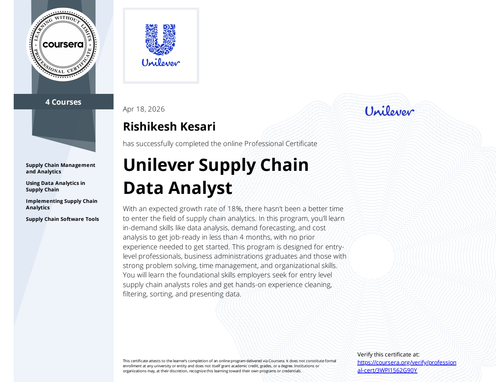

# Supply Chain Analytics Portfolio
I completed a supply chain data analyst professional certificate from Unilever. Skilled I gained: supply chain optimization &management, process, SKU + supplier analysis, inverntory management.

This repository showcases end-to-end supply chain analytics projects focused on optimizing operations across multiple SKUs, including demand analysis, logistics optimization, and inventory planning.

Projects in this portfolio apply data-driven methods to improve service levels, manage safety stock, evaluate lead times, and address warehouse capacity constraints.

## Projects

- Demand Analysis & Forecasting  
  Analysis of SKU-level demand patterns to support planning and forecasting decisions.

- Logistics Cost Optimization  
  Evaluation of transportation modes, lead times, and cost structures across the supply chain network.

- Inventory Strategy & Warehouse Optimization  
  Developed an inventory model for 100+ SKUs, incorporating safety stock and service level targets, and identified a warehouse capacity shortfall.

## Key Skills & Concepts
- SKU-level analysis  
- Demand variability and forecasting  
- Safety stock and service level optimization  
- Lead time analysis  
- Inventory planning and replenishment  
- Warehouse capacity and pallet utilization  
- Supply chain trade-off analysis  

## Tools
- Excel, Google Sheets, Python, PowerBI
- Data analysis and statistical modeling  

*Some projects were developed as part of the Unilever Supply Chain Data Analyst specialization.*
